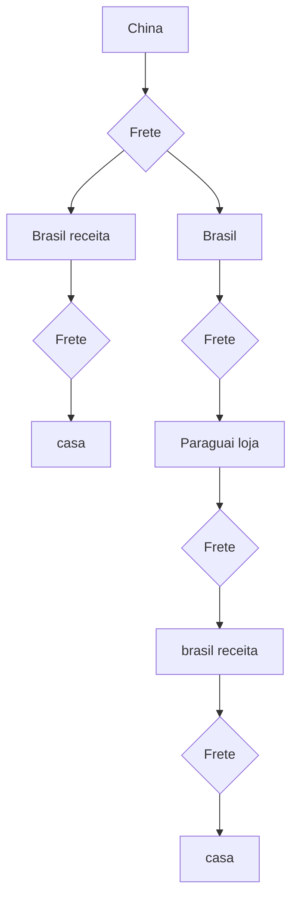

# Sites varejistas do Paraguai iniciam entregas para todo o Brasil pelos Correios
[fonte correios](https://saladeimprensa.correios.com.br/arquivos/14401)

> Paraná – Os Correios iniciaram uma nova modalidade de serviço logístico voltada ao comércio eletrônico, permitindo que consumidores brasileiros comprem produtos diretamente em sites de varejistas paraguaios e recebam suas encomendas em qualquer endereço do Brasil.

Permitindo o quê? Nunca houve qualquer impedimento legal que proibisse esse tipo de transação. Inclusive, o Paraguai já operava o [Exporta Fácil](https://correoparaguayo.gov.py/sitio/correo-es-el-operador-logistico-designado-del-exporta-facil/?utm_source=chatgpt.com), que facilitava esse tipo de operação. 

> A operação do Correios Packet, realizada por modal terrestre, contempla atualmente dois grandes varejistas de Ciudad del Este, no Paraguai: Cellshop e New Zone Importados. As empresas são homologadas no Programa Remessa Conforme, da Receita Federal, e estão habilitadas a comercializar seus produtos para o mercado brasileiro.

`Correios Packet` existe desde 2009 [fonte gazetadopovo](https://www.gazetadopovo.com.br/economia/correios-servico-publico-privado-entrega-internacional/?utm_source=chatgpt.com) e o paraguai ja estava coberto por essa modalidade

> O Correios Packet permite a importação de encomendas de até 30 kg, com rastreamento completo e entrega nos mesmos prazos das encomendas nacionais, a partir da saída do Centro Internacional dos Correios no Brasil.

Atualmente, a Receita Federal informa Centro Internacionais em Curitiba/PR, São Paulo/SP, Valinhos/SP e Galeão/RJ [fonte gov ](https://www.gov.br/receitafederal/pt-br/assuntos/aduana-e-comercio-exterior/manuais/remessas-postal-e-expressa/topicos/remessa-inter?utm_source=chatgpt.com) 

China → Brasil em 10–15 dias

 Chegada ao Brasil → encaminhamento para fiscalização: geralmente 1–5 dias

🛃 Fiscalização/alfândega: pode levar de alguns dias a 2–4 semanas

📦 Depois de liberada → entrega: normalmente 2–7 dias úteis, dependendo da cidade e do serviço

> Para os consumidores brasileiros, a principal vantagem é a possibilidade de adquirir pela internet produtos comercializados por lojistas paraguaios e receber as compras em casa, com comodidade, segurança e a confiabilidade da rede logística dos Correios. 

que vantagem? 

*  os produtos do paraguai vem da china, eu posso comprar direto da china sem atravessador 
* correios confiaveis? eu confio mais na Maersk, na Zim etc...

> Para os varejistas, a nova modalidade amplia o acesso ao mercado brasileiro, contribui para a redução dos custos logísticos e incentiva a formalização das operações e a arrecadação tributária.

`arrecadação tributária` 

> A nova solução conecta mercados, aproxima consumidores e vendedores de diferentes países e contribui para o fortalecimento dos fluxos comerciais transfronteiriços com segurança, eficiência e conformidade regulatória.

## Diagrama frete

